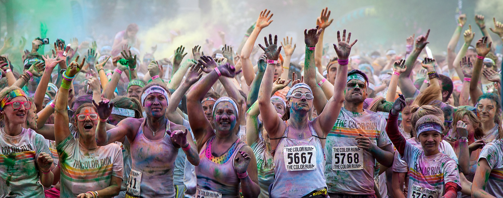

# Optimal Transport

This is a project for the 2nd Year of Master ID3D at University Claude Bernard Lyon 1.
It's about the optimal transport problem.

Here is some illustration of what the algorithm does :

Source images :
 

Output :
